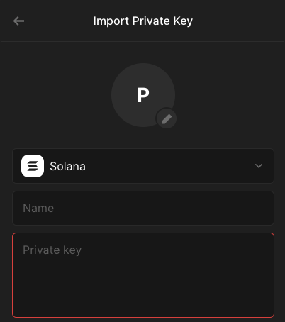
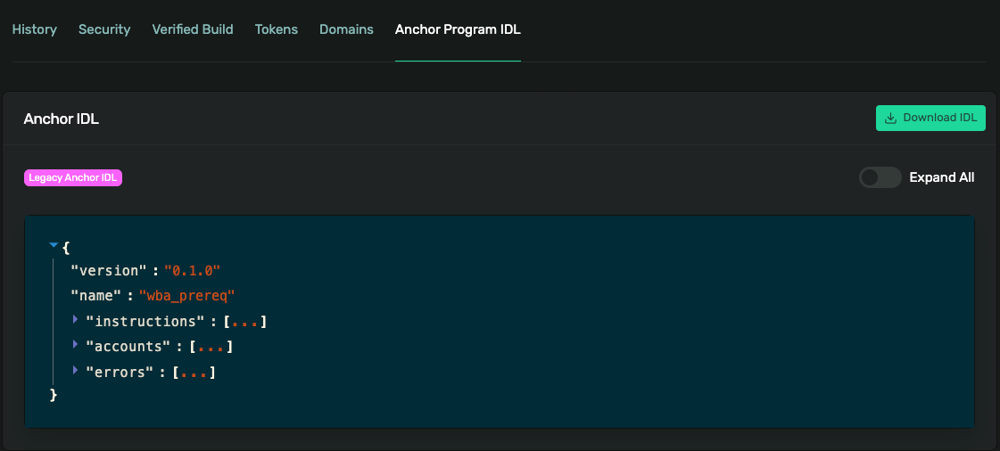

## Turbin3 Prerequisite 2 - Rust

1. **Create a new Keypair**

   1.1. **Setting up**

   `cargo init --lib`

   `cargo add solana-sdk`

   1.2. **Generating a Keypair**

   (fake wallet for demo purposes)

   ```shell
   running 1 test
   You have generated a new Solana wallet: 9HKHTwLarroLF6LgTLsEx1TfoosuBcRTRhLxUajm8jEK

   To save your wallet, copy and paste the following into a JSON file:
   [243, 149, 179, 203, 73, 8, 3, 0, 253, 35, 155, 155, 246, 213, 45, 81, 188, 218, 56, 229, 65, 83, 89, 64, 15, 17, 226, 32, 225, 48, 155, 201, 123, 11, 118, 69, 46, 111, 148, 114, 58, 18, 112, 70, 49, 204, 28, 235, 102, 245, 113, 198, 88, 158, 109, 198, 77, 113, 182, 213, 238, 53, 219, 196]
   test tests::keygen ... ok
   ```

   Click "Run test" on VS Code or execute `cargo test keygen`

1.3. Import/Export to Phantom

```rust
    #[test]
    fn base58_to_wallet(){

        println!("Input your private key as base58:");
        let stdin = io::stdin();
        let base58 = stdin.lock().lines().next().unwrap().unwrap();
        println!("Your wallet file is:");
        let wallet = bs58::decode(base58).into_vec().unwrap();
        println!("{:?}", wallet);

    }

    #[test]
    fn wallet_to_base58(){

        println!("Input your private key as a wallet file byte array:");
        let stdin = io::stdin();
        let wallet = stdin.lock().lines().next().unwrap().unwrap().trim_start_matches('[').trim_end_matches(']').split(',').map(|s| s.trim().parse::<u8>().unwrap()).collect::<Vec<u8>>();
        println!("Your private key is:");
        let base58 = bs58::encode(wallet).into_string();
        println!("{:?}", base58);
```

Import Private Key on Phantom



2. Claim Token Airdrop

`cargo add solana-client`

`cargo test airdrop`

Expected Result: https://solana.fm/tx/4jKsUpu28aWnExgJRivXjejGLeAtGjKHemtkMSdj734gsYTW3j6QvEVhJD1RPtP8e4B2AcgcMwRzE9GwQR1DQt1C?cluster=devnet-solana

3. Transfer tokens to your Turbin3 Address

`cargo add solana-program`

`cargo test transfer_sol`

Expected Result: https://explorer.solana.com/tx/2G2YZtLcQ9njRkBVPg8nVbtnESrsRwv4he8WtXAtKXRDesEHKj1HRNLr2HPihdSNczk1d4BQpiXiggKvFhaKHUXq?cluster=devnet

4. Empty devnet wallet into Turbin3 wallet

`cargo test transfer_sol`

Expected Result: https://explorer.solana.com/tx/2G2YZtLcQ9njRkBVPg8nVbtnESrsRwv4he8WtXAtKXRDesEHKj1HRNLr2HPihdSNczk1d4BQpiXiggKvFhaKHUXq?cluster=devnet

5. Submit your completion of the Turbin3 pre-requisites program

5.1. Consuming an IDL in Typescript



5.2 Creating a PDA

```rust
// Create the PDA
let prereq = Turbin3PrereqProgram::derive_program_address(&[b"prereq",signer.pubkey().to_bytes().as_ref()]);
```

5.3 Putting it all together

`cargo test enroll`

Expected Result:
https://explorer.solana.com/tx/KJXPoKpWbMxQeyB4H2V2DyPKc6ieG25Gd8crnLvF7oKhfnzayWgXeWJ3ZeedZApNbT7jVYbkC2GMxuiRd8rsA3M?cluster=devnet
