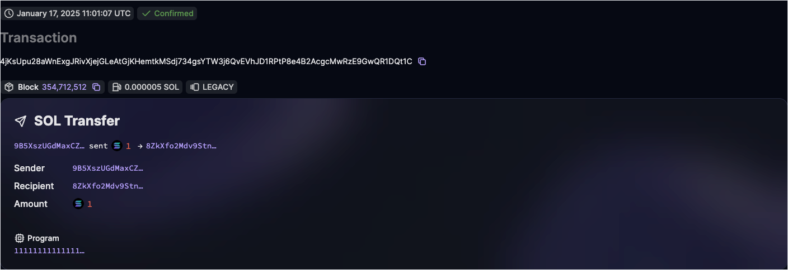
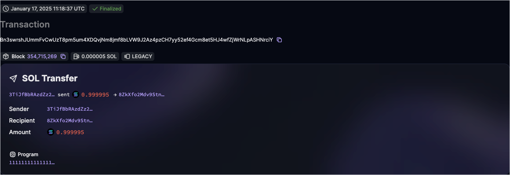

## Turbin3 Prerequisite 1 - Typescript

**Prerequisites:**

- Have NodeJS installed
- Have yarn installed
- Have a fresh folder created to follow this tutorial and all future tutorials

### Keygen

`yarn keygen`

Expected Result:
(fake wallet for demo purposes)

```bash
yarn run v1.22.22
$ ts-node ./prereq/ts/prereq1/keygen.ts
You have generated a new Solana wallet: 3TiJfBbRAzdZz2UVSDF61ZbGfxcfBt7x1cNWKbJYNJyf
[234,221,230,7,12,234,190,82,100,7,195,82,151,6,222,27,95,220,154,103,136,199,182,109,141,31,26,48,218,45,33,209,36,143,45,144,83,74,11,142,152,212,139,39,176,124,57,196,111,44,141,110,6,70,63,145,82,203,82,172,127,159,162,146]
```

### Airdrop

`yarn airdrop`

Expected Result: https://solana.fm/tx/4jKsUpu28aWnExgJRivXjejGLeAtGjKHemtkMSdj734gsYTW3j6QvEVhJD1RPtP8e4B2AcgcMwRzE9GwQR1DQt1C?cluster=devnet-solana



### Transfer

`yarn transfer`

Expected Result: https://solana.fm/tx/Bn3swrshJUmmFvCwUzT8pm5um4XDQvjNm8jmf8bLVW9J2Az4pzCH7yy52ef4Gcm8et5HJ4wfZjWrNLpASHNrciY?cluster=devnet-solana



### Enroll

`yarn enroll`

Expected Result: https://explorer.solana.com/tx/5TDzkN7patuQX7H3VpBzkEHDrFeZDW3o2JXwVksCKdYjR188TBjvFHHJiUh3JTcmLk2aPcmqpZCJAbkPXJoaGHdr?cluster=devnet

> ⚠️ Double-check the contract address from Turbin3, sometimes it can change
